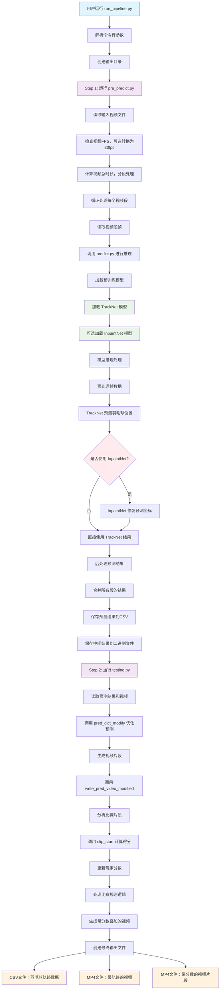

# 羽毛球分析系统代码调用流程图

## 主要模块说明

### 1. 主控制流程 (run_pipeline.py)
- 协调整个分析流程
- 按顺序执行预预测和测试两个阶段
- 处理错误和计时

### 2. 预预测阶段 (pre_predict.py)
- 视频分段处理，避免内存溢出
- 调用核心推理模块
- 合并多个段的预测结果

### 3. 核心推理 (predict.py)
- 加载和缓存预训练模型
- 实现滑动窗口推理
- 支持 TrackNet + InpaintNet 组合

### 4. 模型架构 (model.py)
- **TrackNet**: U-Net结构的羽毛球检测网络
- **InpaintNet**: 1D卷积网络，修复预测坐标

### 5. 测试和评分 (testing.py)
- 优化预测结果，过滤噪声
- 实现羽毛球比赛规则逻辑
- 生成带分数叠加的输出视频

### 6. 工具函数 (utils/)
- **general.py**: 通用图像处理和数据转换
- **func_clips_start_end.py**: 比赛片段分析和得分计算
- **left_right.py**: 球员位置识别
- **ullasmodel.py**: 球场中线检测

## 数据流向

1. **输入**: MP4视频文件
2. **中间处理**: 帧序列 → 预测坐标 → 优化结果
3. **输出**: 
   - CSV轨迹数据
   - 带轨迹的视频
   - 带分数的视频片段

## 关键技术特点

- **分段处理**: 支持长视频，避免内存问题
- **模型缓存**: 避免重复加载模型
- **滑动窗口**: 时序预测，提高准确性
- **规则引擎**: 自动计算羽毛球比赛得分
- **多模型融合**: TrackNet + InpaintNet 提升性能
